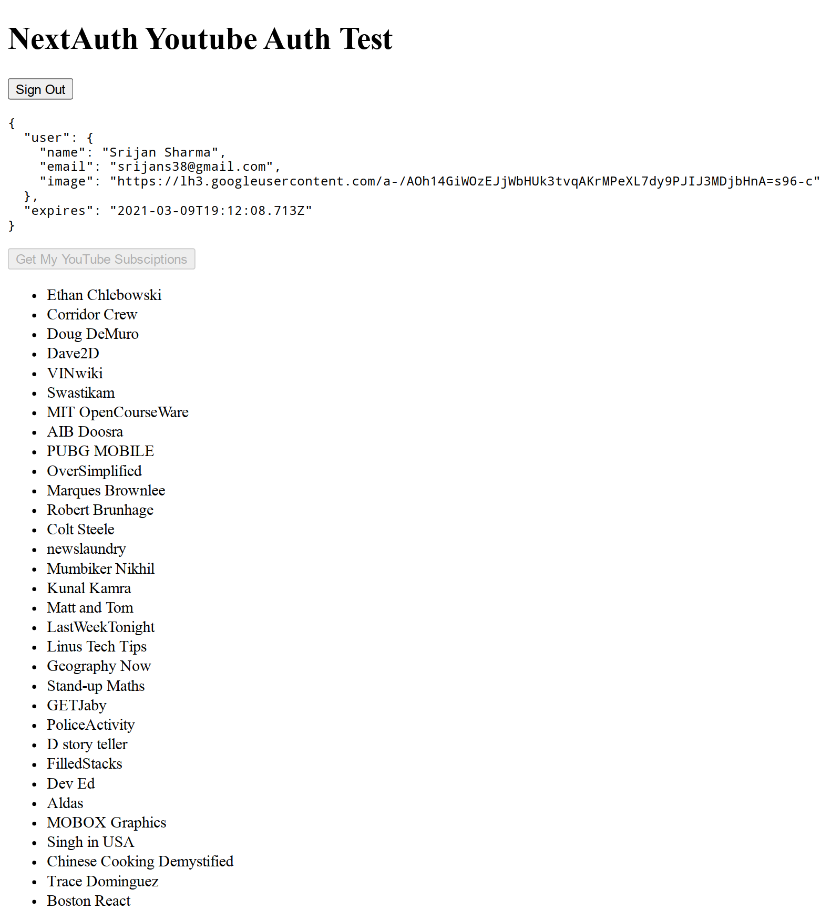

NextAuth is an amazingly simple library for authentication in your Next.js application.
You just `npm install next-auth`, make a `[...nextauth].js` API route, specify your providers (Google, Spotify, etc.)
and you are good to go.

## The Problem

This is all well and good for just authentication of users. But, what if we want to do more.
For an example, I was looking for a solution to authenticate with Google and get all the YouTube subsciptions that the
authenticated user has.

For this to happen, we would need the **access token** for the authenticated account. Let's look at how we would go
about doing this.

## Basic Setup

You can find the accompanying repo [here](https://github.com/srijans38/nextauth-youtube-test)

First, we need a Next.js project that we can quickly bootstrap with `npx create-next-app` or `yarn create next-app`.

Then, add NextAuth with `yarn add next-auth` or `npm install next-auth`

Next, create a new API route for NextAuth at `pages/api/auth/[...nextauth].js` with the contents:

```js
import NextAuth from 'next-auth';
import Providers from 'next-auth/providers';

export default NextAuth({
  providers: [
    Providers.Google({
      clientId: process.env.GOOGLE_CLIENT_ID,
      clientSecret: process.env.GOOGLE_CLIENT_SECRET,
      authorizationUrl:
        'https://accounts.google.com/o/oauth2/v2/auth?prompt=consent&access_type=offline&response_type=code',
      scope:
        'https://www.googleapis.com/auth/userinfo.profile https://www.googleapis.com/auth/userinfo.email https://www.googleapis.com/auth/youtube.readonly',
    }),
  ],
  secret: process.env.SECRET,
});
```

We don't yet have a Client ID and Client Secret for Google OAuth 2, head to [Google API Console](https://console.developers.google.com/apis/credentials) to generate these.
Make sure you add _http://localhost:3000/api/auth/callback/google_ as an authorized callback URL.

Once, generated add them to `.env.local` as environment variables, which Next.js should pickup automatically.

And, we also need a **SECRET** string (just generate a random string) as an env var that NextAuth recommends having.

Also, notice the **scope** parameter, which tells what kinds of data that we are requesting access for.

Let's get our `pages/index.js` setup. Replace all the boilerplate code with the contents below.

```jsx
import { signIn, signOut, useSession } from 'next-auth/client';
...
export default function Home() {

  const [session, loadingSession] = useSession();

  return (
    <div>
      ...
      {!session && (
        <>
          <button onClick={() => signIn()}>Sign In</button>
        </>
      )}

      {session && (
        <>
          <button onClick={() => signOut()}>Sign Out</button>
          <p>
            <pre>{JSON.stringify(session, null, 2)}</pre>
          </p>
        </>
      )}
      ...
    </div>
}
...
```

If all goes well, You should now be able to login with Google.

## The Solution

Among the various options provided in the NextAuth config object, there's one option called
**callbacks**. As mentioned in the Docs, Callbacks are asynchronous functions you can use to control what happens when an _action_ is performed.
These are : Sign in, Redirect, Session and JWT. The JWT callback is what we are interested in.
It is an async function that receives `token`, `user`, `account`, `profile` and `isNewUser` as inputs.

The `account` object has the access token and refresh token and is only passed in on Sign In.

The `token` object is what is returned by default. Thus, by adding to this token object, we can forward whatever we need as part of the JWT. You can `console.log` for all the input objects to get what you need. In our case,we just need the access token.

The JWT callback inside the NextAuth options can be implemented as :

```js
export default NextAuth({
  ...
  callbacks: {
      async jwt(token, user, account, profile, isNewUser) {
        if (account?.accessToken) {
          token.accessToken = account.accessToken;
        }
        return token;
      },
    },
  ...
});
```

Now, we are all set to use the access token for authenticating our requests to our desired Google API( YouTube Data API in this case) for private data.

We can do this in an API route `pages/api/getYTData.js` like:

```js
import { getToken } from 'next-auth/jwt';

const secret = process.env.SECRET;
let accessToken;

export default async (req, res) => {
  const token = await getToken({ req, secret });

  accessToken = token.accessToken;

  const data = await getYTData();

  res.status(200).json(data);
};
```

Here, `getToken` function provided by NextAuth is used for decrypting the JWT. The `getYTData` function can be implemented by following the [YouTube Data API Docs](https://developers.google.com/youtube/v3/getting-started)

This API route can now be used on the front-end with a fetch for `/api/getYTData` inside a useEffect or however you like to do data fetching. Just make to sure include credentials while fetching (with `{credentials: 'include'}` for fetch and `{withCredentials: true}` for axios).

The final result could something like this. Here, the list of YouTube subsciptions of the authorized user is fetched.



That's all for this one. You can find the repo for this post [here](https://github.com/srijans38/nextauth-youtube-test) and a working ( non-working because Google OAuth is in test mode for this) demo [here](https://ytauthtest.vercel.app/).
