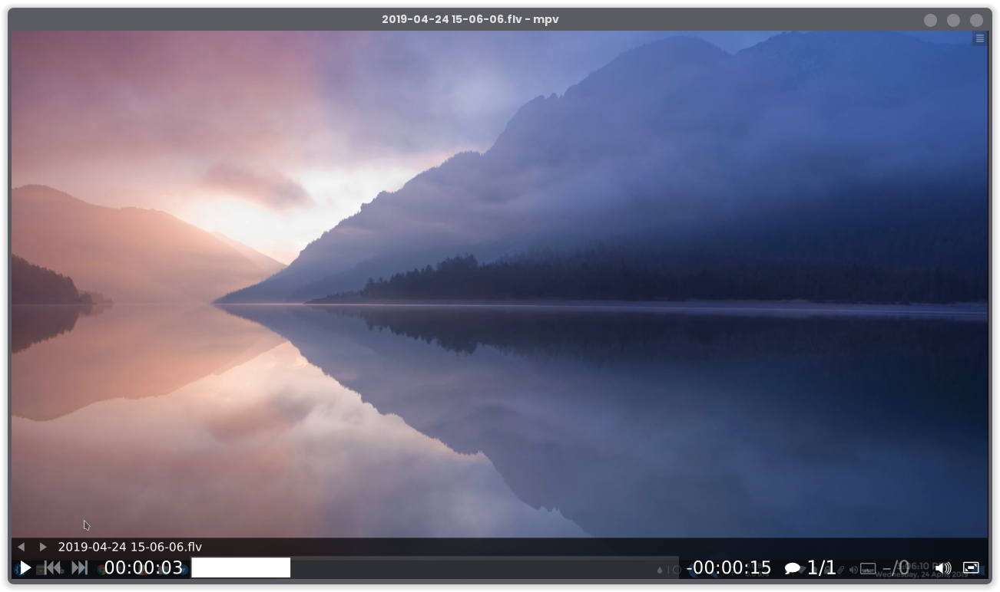

We all know that GNU/Linux is a fantastic alternative to Windows/Mac for a variety of reasons(especially as a developer). But finding the right apps has always been a hassle. These are some of the apps that I have grown to love in my time using GNU/Linux as my primary OS of choice.

I will try to categorize these apps as much as I can but there maybe some randomness in the list. Also, this list maybe biased towards a lot of KDE apps just because that's my distro of choice.

Keep in mind that this list may contain non-FOSS apps as well.

## Office

---

### LibreOffice

LibreOffice has been the de-facto office suite for Linux users. It provides impressive support for Microsoft Office files and is kept updated. Writer is the word processor, Calc is the spreadsheet program. Impress is for presentations. Draw is for diagramming and flow-charting. Base is the database manager and Math is for formulas. As almost all of the FOSS office suites, LibreOffice uses the OpenDocument Format, which is a standardized format for office documents.

###### Ubuntu

`sudo apt install libreoffice`

###### Arch

`yay -S libreoffice-fresh`

### Joplin

Joplin is my preferred note-taking application. This is a fantastic application, if you prefer to write in Markdown. This blog article was also written using Joplin. It has a full WYSIWYG interface, supports plugins and Dropbox synchronization. It's all you can ask for in a note-taking application.

###### Snap

`sudo snap install joplin-james-carroll`

###### Arch

`yay -S joplin-appimage`

### Mailspring

Mailspring is a beautiful Email application. The highlight for the app is the link tracking and read receipts features. With this, you can see when the email you sent was opened. It also looks fantastic.

###### Snap

`sudo snap install mailspring`

###### Arch

`yay -S mailspring`

## Graphics

---

### Okular

Okular is a fantastic document viewer that supports PDFs, EPubs, Markdown and images. It has a simple, and fast UI and looks great especially if you are running KDE.

###### Ubuntu

`sudo apt install okular`

###### Arch

`yay -S okular`

### Darktable

Darktable is an open-source photographs manager and raw development application. It is a Lightroom alternative. If you take a lot of RAW pictures this will definitely be an awesome addition to your workflow.

###### Ubuntu

`sudo apt install darktable`

###### Arch

`yay -S darktable`

### InkScape

InkScape is free and open-source vector graphics editor. Considering my lack of design skills, I personally use InkScape to edit PDFs, which it can do effectively. You'll love this if you are an illustrator.

###### Ubuntu

`sudo apt install inkscape`

###### Arch

`yay -S inkscape`

## Multimedia

---

### mpv

mpv is a sweet, simple and minimal media player. It is based on Mplayer and FFmpeg. It has an extremely minimal approach for the UI. Once you learn the shortcuts, this player is a breeze to use.

###### Ubuntu

`sudo apt install mpv`

###### Arch

`yay -S mpv`

### OBS Studio

Does this even need an introduction. This is hands-down the best recording/streaming solution out there.

###### Ubuntu

`sudo apt install obs-studio`

###### Arch

`yay -S obs-studio`

### Vocal

Vocal is my favorite podcast client. It comes with support for the iTunes Podcast Library and you can also add your own podcasts from elsewhere.

###### Flatpak

`flatpak install --from https://flathub.org/repo/appstream/com.github.needleandthread.vocal.flatpakref `

###### Arch

`yay -S vocal`

## Utilities

---

### Filelight

Filelight helps you visualise your disk usage, and helps you in finding the files that are taking a huge part of your disk. It has been very useless when trying to clean up some space on your system.

Another cleaning utility to recover space would be Bleachbit, which can free caches, temp files, logs, etc.

###### Ubuntu

`sudo apt install filelight`

###### Arch

`yay -S filelight`

So, that's all for this one. Happy Linux Adventures!
