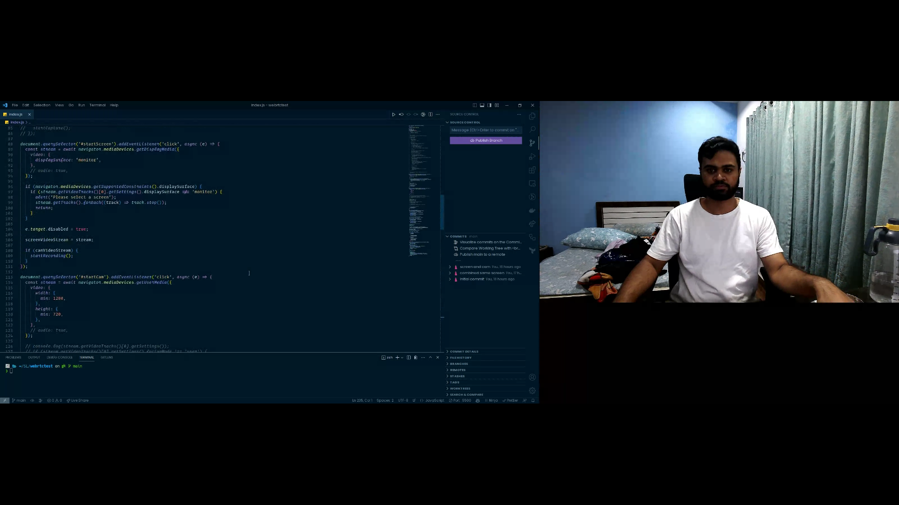

## The Problem

Recently I came across a problem where I had to record/stream a user's webcam and their screen share simultaneously to a back-end. This seemed like a fairly straight forward problem to solve. Just get the the streams using the [Media Devices](https://developer.mozilla.org/en-US/docs/Web/API/MediaDevices) Interface's `getUserMedia` and `getDisplayMedia` APIs. Then, depending on the back-end setup, we could maybe pass these streams through [MediaStream Recording API](https://developer.mozilla.org/en-US/docs/Web/API/MediaStream_Recording_API) and get (let's say, 1 second) chunks of binary video data and stream these chunks using WebSockets to the back-end.

This setup works very well if you have the back-end resources to then be able to merge these separate chunks of binary video into two single files or merge these two streams into a single side by side view video file.

And, this got me wondering, is there a way we could combine two streams(or videos, for the matter) into a single side by side video, all in the browser itself?

## The Canvas API to the rescue

Well, it turns out that the [MediaStream Recording API](https://developer.mozilla.org/en-US/docs/Web/API/MediaStream_Recording_API) can literally take a `<canvas>` element as an input(it also takes `<video>` and `<audio>` elements, btw). And, guess what? We can "render" a video in the canvas using the [`drawImage`](https://developer.mozilla.org/en-US/docs/Web/API/CanvasRenderingContext2D/drawImage) method of the 2D rendering context.

Voila! Bingo! We have a solution in our hands.

Let's code this up now.

## Demo Time

Here, I am using plain JavaScript for the demo.

First, we need two global variables to store our streams for the webcam and the screen.

```js
let camVideoStream = null;
let screenVideoStream = null;
```

And we'll also need a `const` to store the options that we'll later pass to the [`MediaRecorder`](https://developer.mozilla.org/en-US/docs/Web/API/MediaRecorder/MediaRecorder#parameters) constructor.

```js
const options = {
  mimeType: 'video/webm; codecs=vp8',
};
```

For the `mimeType`, I found WebM VP8 codec to be the best supported across Chrome and Firefox. I used this stackoverflow [answer](https://stackoverflow.com/a/64656254) to figure this out.

And we'll also need an array to store our video chunks into.

```js
const chunks = [];
```

Now, we can have two buttons in the document, each to get permissions and start the streams from webcam and screen.

```js
document.querySelector('#startScreen').addEventListener('click', async (e) => {
  const stream = await navigator.mediaDevices.getDisplayMedia({
    video: {
      displaySurface: 'monitor',
    },
  });

  e.target.disabled = true;

  screenVideoStream = stream;

  if (camVideoStream) {
    startRecording();
  }
});

document.querySelector('#startCam').addEventListener('click', async (e) => {
  const stream = await navigator.mediaDevices.getUserMedia({
    video: {
      width: {
        min: 1280,
      },
      height: {
        min: 720,
      },
    },
  });

  e.target.disabled = true;

  camVideoStream = stream;

  if (screenVideoStream) {
    startRecording();
  }
});
```

Now, we can create the `startRecording` function.

```js
function startRecording() {
  const screenVideo = document.createElement('video');
  screenVideo.srcObject = screenVideoStream;

  // Getting the dimensions of the stream
  const screenVideoStreamWidth = screenVideoStream
    .getVideoTracks()[0]
    .getSettings().width;
  const screenVideoStreamHeight = screenVideoStream
    .getVideoTracks()[0]
    .getSettings().height;

  const camVideo = document.createElement('video');
  camVideo.srcObject = camVideoStream;

  // Getting the dimension of the stream
  const camVideoStreamWidth = camVideoStream
    .getVideoTracks()[0]
    .getSettings().width;
  const camVideoStreamHeight = camVideoStream
    .getVideoTracks()[0]
    .getSettings().height;

  screenVideo.play();
  camVideo.play();

  // Calculating the dimensions of our canvas where we'll place the videos side by side
  let width = camVideoStreamWidth + screenVideoStreamWidth + 2,
    height = Math.max(camVideoStreamHeight, screenVideoStreamHeight);

  const canvas = document.createElement('canvas');
  canvas.width = width;
  canvas.height = height;
  const ctx = canvas.getContext('2d');

  const interval = setInterval(() => {
    // Drawing the videos at their desired positions
    // You can also put text here(like timestamp etc.) on the video(or anything else that the canvas supports)
    ctx.drawImage(
      screenVideo,
      0,
      0,
      screenVideoStreamWidth,
      screenVideoStreamHeight
    );
    ctx.drawImage(
      camVideo,
      screenVideoStreamWidth + 2,
      0,
      camVideoStreamWidth,
      camVideoStreamHeight
    );
    // 30 fps
  }, 1000 / 30);

  const recorder = new MediaRecorder(canvas.captureStream(30), options);

  recorder.ondataavailable = (e) => {
    chunks.push(e.data);
  };

  recorder.onstop = (e) => {
    const blob = new Blob(chunks, { type: 'video/webm' });
    const url = URL.createObjectURL(blob);
    const a = document.createElement('a');
    a.href = url;
    a.download = 'combined.webm';
    a.click();
  };

  // Creating chunks of 1 second each
  recorder.start(1000);

  // Stopping the recording after 10 seconds
  setTimeout(() => {
    camVideo.pause();
    screenVideo.pause();
    camVideoStream.getTracks().forEach((track) => track.stop());
    screenVideoStream.getTracks().forEach((track) => track.stop());
    clearInterval(intverval);
    recorder.stop();
  }, 10000);
}
```

Here's how the output looks like. (This is a single frame from the video output)



And there we have it.

This was a lot of fun to figure out and I have a ton of useful ideas that I can use this in.

I'll have more canvas adventure in the future.
